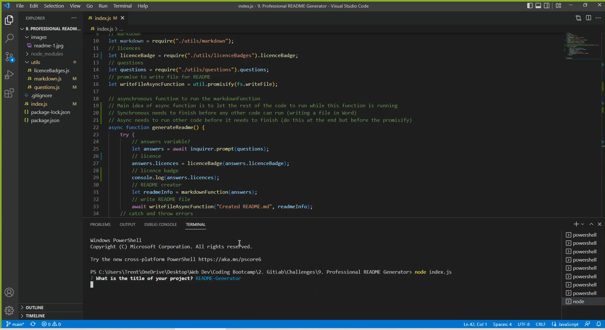
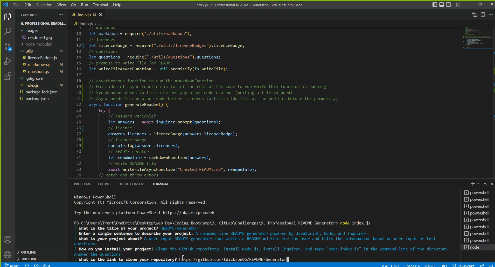
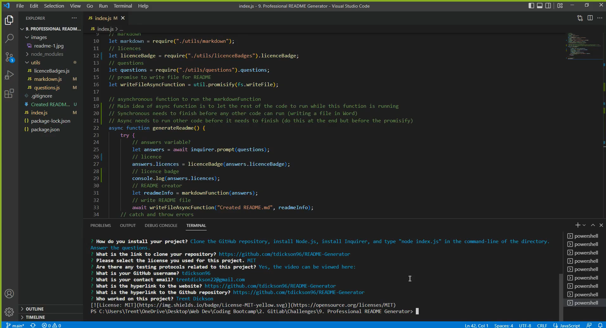
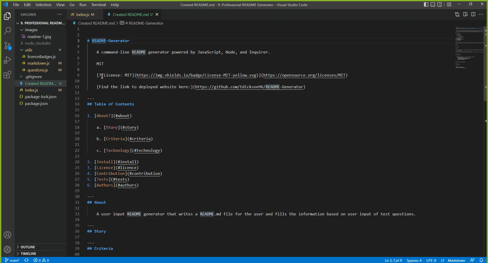

# README-Generator

    A command-line README generator powered by JavaScript, Node, and Inquirer. 

[Find the link to deployed website here](https://github.com/tdickson96/README-Generator)

---
## Table of Contents

1. [About!](#about)

    a. [Story](#story)

    b. [Criteria](#criteria)

    c. [Technology](#technology)
    
2. [Install](#install)
3. [Licence](#licence)
4. [Contribution](#contribution)
5. [Tests](#tests)
6. [Authors](#authors)

---
## About 

    A user input README generator that writes a README.md file for the user and fills the information based on user input of questions. The README file includes the project title, a description, a table of contents, an install guide, usage, a licence, contributions, tests, and user information and questions. 

---
## Story

    As a user, I found writing out my README.md files to be a practice in patience, markdown, and syntax. Now, as I have evolved as a programmer, I would like to cut down the time I spend formatting my README.md files and focus more on the quality of the content. Here, I have used Node and Inquirer to develop a markdown format that generates a README file after answering a series of questions.

---
## Technology

Inquirer
Node
JavaScript

---
## Install

    Clone the GitHub repository, install Node.js, install Inquirer, and type "node index.js" in the command-line of the directory. Answer the questions.

    Clone the repository:

        git clone https://github.com/tdickson96/README-Generator

---
## Contribution

    If you would like to learn how to assist or contribute to this project:
        - Fork the repository
        - Create a feature branch (git checkout -b NAME)
        - Commit your new feature (git commit -m "feature")
        - Push your feature branch (git push)
        - Create a new pull request

---
## Usage

[The test video can be viewed here](https://drive.google.com/file/d/1ijO0zV_Fi_tVfIAT02XkemIEk_q3ZH27/view?usp=sharing)

---
## Authors

    Trent Dickson

---
## Contact

> GitHub username: tdickson96

> Contact email: trentdickson22@gmail.com
